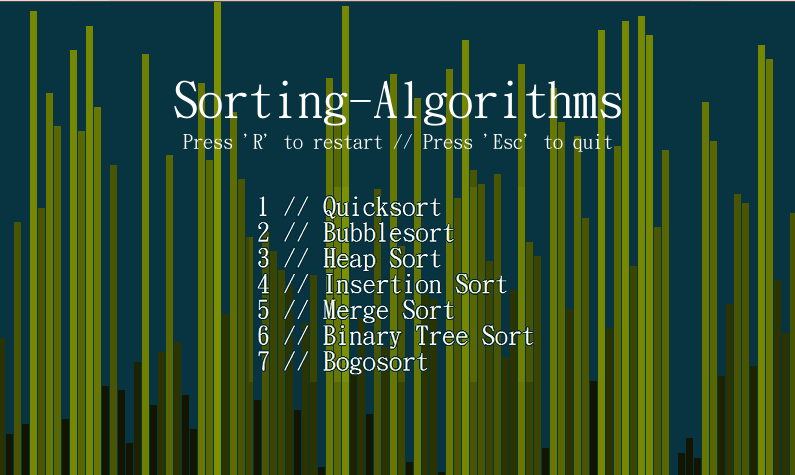

# Sorting-Algorithms
Porting over various sorting algorithms I made earlier this year to python3, complete with a stress testing function and visualiser/sonifier.

The visualiser features support for varying the speed of the animation, the length of the array to be sorted, and the distribution of the array values (default is a linear shuffle)

Sonification is in the process of being ported over from an earlier version, and will be implemented soon.
 
Sample:
---------------

Example of quicksort for n = 500:

TODO
----------

 - [x] Port visualiser
 - [x] Add bubblesort
 - [x] Add quicksort
 - [ ] Add heapsort
 - [ ] Add insertionsort
 - [ ] Add mergesort
 - [ ] Add binarytreesort
 - [ ] Add bogosort
 - [ ] Port sonifier
