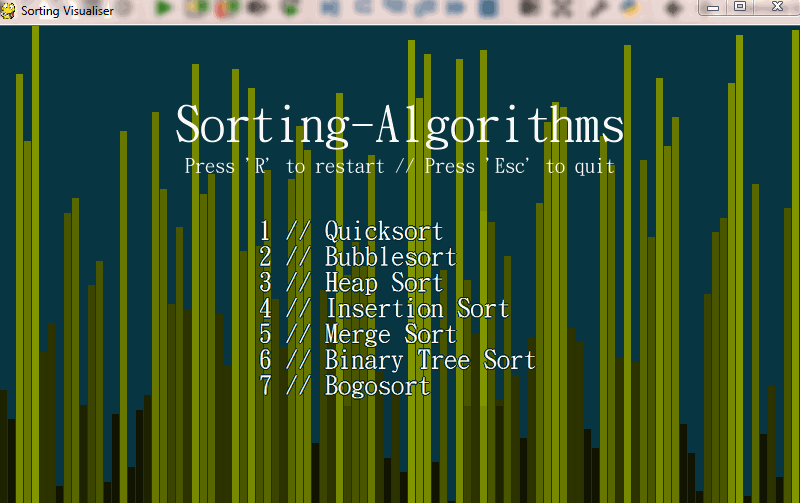
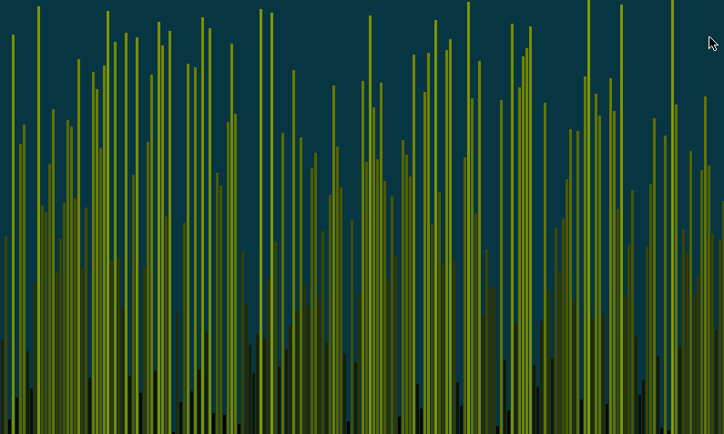

# Sorting-Algorithms
Various sorting algorithms I made earlier this year, as well a stress testing function and a visualiser. Sonifier should be on its way soon too. Run ```visualiser.py``` to start.

The visualiser features a nice UI, support for varying the speed of the animation (up and down arrow keys), the length of the array to be sorted, and the distribution of the array values (default is a linear shuffle)

Sonification is in the process of being ported over from an earlier version, and will be implemented soon.
 
Sample:
---------------


Example of quicksort for n = 500:



TODO
----------

 - [x] Port visualiser
 - [x] Add bubblesort
 - [x] Add quicksort
 - [x] Add heapsort
 - [x] Add insertionsort
 - [x] Add mergesort
 - [ ] Add binarytreesort
 - [ ] Add bogosort
 - [ ] Port sonifier
 - [ ] Add side-by-side comparison?
